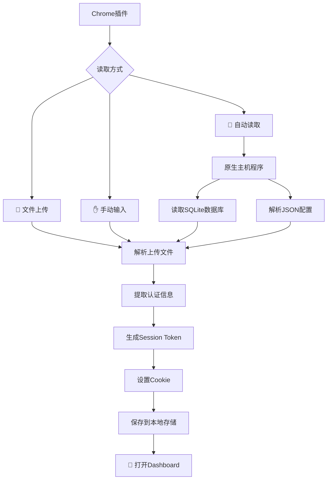
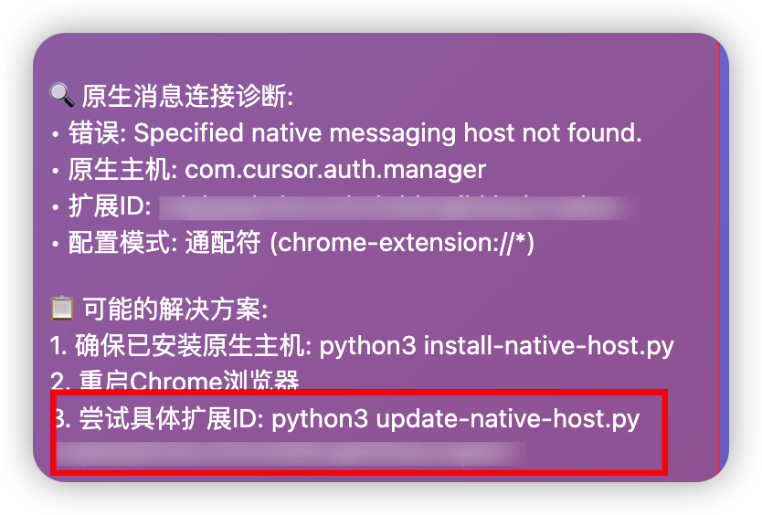

# 🎯 Cursor Client2Login

<div align="center">


**一个Chrome浏览器插件，用于读取本地Cursor认证信息，管理web端Cursor认证信息和Web端多账户快速切换**
[📖 使用指南](#-使用指南) • [⚡ 快速开始](#-快速开始) • [🔧 故障排除](#-故障排除) • [🤝 贡献](#-贡献)

</div>

---

## ✨ 功能特性

### 🔥 核心功能
- **🤖 自动读取** - 智能读取本地Cursor数据库和配置文件
- **📁 文件上传** - 支持拖拽上传scope_v3.json文件
- **✋ 手动输入** - 手动填写认证信息
- **🔄 多账户管理** - 保存和快速切换多个Cursor账户
- **🎯 一键登录** - 自动设置Cookie并跳转到Dashboard

### 🛠️ 技术特性
- **跨平台支持** - 完全(bushi)支持Windows、macOS、Linux(目前只测试了macOS ,Windows没有机器，我就没有测试)
- **原生主机通信** - 通过原生主机程序安全读取本地文件
- **智能错误处理** - 详细的错误诊断和解决方案提示
- **现代化UI** - 美观的Material Design风格界面
- **数据安全** - 所有数据仅在本地处理，不上传任何服务器

## 📸 扩展ID获取指南

> **如何获取Chrome扩展ID：**
> 1. 在Chrome地址栏输入 `chrome://extensions/`
> 2. 找到"Cursor Client2Login"扩展
> 3. 复制扩展ID（通常是32位字符串）
> 4. 使用该ID运行配置命令

*扩展ID示例：`abcdefghijklmnopqrstuvwxyz123456`*

## 🎮 工作原理



## ⚡ 快速开始

### 📋 系统要求
- Chrome浏览器 88+
- Python 3.6+ (用于原生主机程序)
- 已安装并登录过Cursor

### 🚀 安装步骤

1. **下载插件**
   ```bash
   git clone https://github.com/aiflyzx123/cursor-client2login.git
   cd cursor-client2login
   ```

2. **安装到Chrome**
   - 打开 `chrome://extensions/`
   - 开启"开发者模式"
   - 点击"加载已解压的扩展程序"
   - 选择项目文件夹

3. **安装原生主机**(推荐)
   ```bash
       # macOS/Linux
    python3 install_native_host.py install
   
   # Windows
   python install_native_host.py install
   ```

4. **更新原生主机配置扩展ID**
   - 在Chrome中打开 `chrome://extensions/`
   - 找到"Cursor Client2Login"扩展
   - 复制扩展ID（如下图红框所示）
   - 运行命令更新配置：
   ```bash
   # macOS/Linux
   python3 update_native_host.py YOUR_EXTENSION_ID
   
   # Windows
   python update_native_host.py YOUR_EXTENSION_ID
   ```
   

5. **重启Chrome浏览器**

### 🎯 首次使用

1. **配置扩展ID**（仅首次需要）
   - 按照上述步骤4获取并配置扩展ID
   - 重启Chrome浏览器

2. 点击Chrome工具栏中的插件图标
3. 选择"🤖 自动读取"标签
4. 点击"🔍 自动读取Cursor数据"
5. 插件将自动完成所有配置并打开Dashboard

## 📖 使用指南

### 方式一：🤖 自动读取（推荐）

**优势**：完全自动化，无需手动操作

1. 确保已安装原生主机程序
2. 点击"🔍 自动读取Cursor数据"
3. 等待自动提取和设置完成

### 方式二：📁 文件上传

**适用场景**：无法安装原生主机或权限受限

1. 找到配置文件：
   - **macOS**: `~/Library/Application Support/Cursor/sentry/scope_v3.json`
   - **Windows**: `%APPDATA%\Cursor\sentry\scope_v3.json`
2. 拖拽文件到上传区域
3. 手动输入Access Token
4. 点击"📋 处理文件数据"

### 方式三：✋ 手动输入

**适用场景**：需要精确控制或调试

1. 手动获取所需数据：
   - **Email**: 从scope_v3.json提取
   - **User ID**: 从scope_v3.json的id字段提取
   - **Access Token**: 从SQLite数据库查询获取
2. 填写表单并提交

## 🔄 多账户管理

### 添加账户
使用任意方式导入新的Cursor账户，所有账户都会自动保存

### 快速切换

#### 插件内切换
- 在"已保存的账户"列表中点击"切换"按钮

#### 网站内切换
1. 访问任何 cursor.com 页面
2. 点击右上角的 🎯 浮动按钮
3. 选择要切换的账户
4. 页面自动刷新并应用新认证

## 📁 项目结构

```
cursor-client2login/
├── 📄 manifest.json          # 插件配置文件
├── 🔧 background.js          # 后台服务脚本
├── 🎨 popup.html            # 弹出窗口页面
├── ⚡ popup.js              # 弹出窗口逻辑
├── 📝 content.js            # 内容脚本
├── 🐍 native_host.py        # 原生主机程序
├── 🛠️ install_native_host.py # 原生主机安装器
├── 📋 native_host.json      # 原生主机配置模板
├── 🔄 update_native_host.py # 配置更新工具
└── 🔧 troubleshooting/      # 故障排除文档
    ├── diagnose.md          # 诊断指南
    ├── fix-steps.md         # 修复步骤
    ├── test-results.md      # 测试结果
    ├── wildcard-test.md     # 通配符测试
    ├── delete-account-fix.md # 账户删除修复
    └── cursor_auth_manage.py # 认证管理工具
```

## 🔧 故障排除

### 常见问题

<details>
<summary>❌ "找不到原生主机程序"</summary>

**解决方案**：
1. 确保已安装原生主机程序
2. **完全重启Chrome浏览器**（最重要）
3. 检查Python是否正确安装
4. 使用具体扩展ID更新配置：
   ```bash
   python3 update_native_host.py <your-extension-id>
   ```
</details>

<details>
<summary>❌ 自动读取失败</summary>

**解决方案**：
1. 确保Cursor已安装并至少登录过一次
2. 检查文件权限：
   ```bash
   chmod +x native_host.py
   ```
3. 查看Chrome扩展控制台错误信息
</details>

<details>
<summary>❌ Cookie设置失败</summary>

**解决方案**：
1. 确保有 www.cursor.com 的访问权限
2. 检查Chrome的Cookie设置
3. 尝试手动访问 cursor.com 一次
</details>

<details>
<summary>❌ AccessToken无效</summary>

**解决方案**：
1. Token可能已过期，重新登录Cursor
2. 确保复制的Token完整无误
3. 检查数据库文件是否最新
</details>

### 🔍 调试模式

启用详细错误信息：
1. 右键点击插件图标
2. 选择"检查弹出内容"
3. 在Console标签查看详细日志

## 🛡️ 安全说明

- ✅ **本地处理** - 所有认证数据仅在本地处理
- ✅ **无服务器通信** - 不会发送数据到任何外部服务器
- ✅ **权限最小化** - 仅请求必要的浏览器权限
- ✅ **开源透明** - 完全开源，代码透明可审计

**安全建议**：
- 定期更新AccessToken确保安全性
- 如怀疑账户安全，请及时更改Cursor密码
- 妥善保管AccessToken等敏感信息

## 🚀 开发指南

### 本地开发

1. **克隆仓库**
   ```bash
   git clone https://github.com/aiflyzx123/cursor-client2login.git
   cd cursor-client2login
   ```

2. **安装依赖**
   ```bash
   # 安装原生主机
   python3 install_native_host.py install
   ```

3. **加载到Chrome**
   - 开启开发者模式
   - 加载已解压的扩展程序

4. **更新原生主机配置扩展ID**


### 🧪 测试

```bash
# 测试原生主机程序
python3 native_host.py

# 测试特定扩展ID配置
python3 update_native_host.py <extension-id>
```

## 🤝 贡献

欢迎贡献代码！请遵循以下步骤：

1. Fork 这个仓库
2. 创建特性分支 (`git checkout -b feature/AmazingFeature`)
3. 提交更改 (`git commit -m 'Add some AmazingFeature'`)
4. 推送到分支 (`git push origin feature/AmazingFeature`)
5. 打开 Pull Request

### 🐛 报告问题

请使用 [GitHub Issues](https://github.com/aiflyzx123/cursor-client2login/issues) 报告问题，并提供：
- 操作系统和版本
- Chrome版本
- 详细的错误信息
- 复现步骤

## 📝 更新日志

### v1.0.0 (最新版本)
- ✅ 支持三种导入方式：自动读取、文件上传、手动输入
- ✅ 原生主机程序支持自动读取本地文件
- ✅ 支持多账户管理和快速切换
- ✅ 提供在线账户切换浮动按钮
- ✅ 自动设置Cookie和打开Dashboard
- ✅ 美观的现代化UI界面
- ✅ 支持拖拽文件上传
- ✅ 跨平台支持（Windows、macOS、Linux）
- ✅ 智能错误诊断和修复提示

## 📄 许可证

本项目采用 MIT 许可证 - 查看 [LICENSE](LICENSE) 文件了解详情

## 🙏 致谢

- 感谢 [Cursor](https://cursor.com) 提供优秀的AI编程工具
- 感谢所有贡献者和用户的支持

---

<div align="center">

**如果这个项目对你有帮助，请给个 ⭐ Star！**

[🐛 报告问题](https://github.com/aiflyzx123/cursor-client2login/issues) • [💡 功能建议](https://github.com/aiflyzx123/cursor-client2login/discussions) • [📖 查看Wiki](https://github.com/aiflyzx123/cursor-client2login/wiki)

Made with ❤️ by the community

</div>