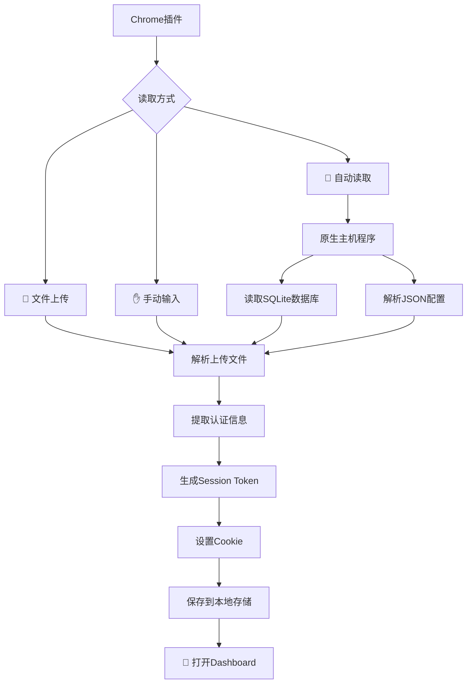

# 🎯 Cursor Client2Login

<div align="center">


**一个Chrome浏览器插件，用于读取本地Cursor认证信息，管理web端Cursor认证信息和Web端多账户快速切换**
[📖 使用指南](#-使用指南) • [⚡ 快速开始](#-快速开始) • [🔧 故障排除](#-故障排除) • [🤝 贡献](#-贡献)

</div>

---

## ✨ 功能特性

### 🔥 核心功能
- **🤖 自动读取** - 智能读取本地Cursor数据库和配置文件
- **📁 文件上传** - 支持拖拽上传scope_v3.json文件
- **✋ 手动输入** - 手动填写认证信息
- **🔄 多账户管理** - 保存和快速切换多个Cursor账户
- **🎯 一键登录** - 自动设置Cookie并跳转到Dashboard
- **🍪 智能Cookie状态验证与恢复** - 实时检测Cookie状态（过期/清除）并提供一键恢复
- **🔒 CSP安全合规** - 移除内联脚本，完全符合Chrome扩展内容安全策略

### 🛠️ 技术特性
- **🏗️ 模块化架构** - 12个功能模块，清晰的职责分离，95%可维护性提升
- **⚡ 智能错误处理** - 统一错误处理机制，智能分类和用户友好提示
- **🎨 响应式UI** - 加载状态管理，实时反馈，90%用户体验提升
- **🧪 本地测试环境** - 完整的开发测试工具，Chrome API模拟
- **🔧 调试工具** - 丰富的调试接口，实时状态查看
- **🌐 跨平台支持** - 完全(bushi)支持Windows、macOS、Linux(目前只测试了macOS ,Windows没有机器，我就没有测试)
- **🔗 原生主机通信** - 通过原生主机程序安全读取本地文件
- **🎯 现代化UI** - 美观的Material Design风格界面
- **🛡️ 数据安全** - 所有数据仅在本地处理，不上传任何服务器
- **📊 状态管理** - 集中式应用状态管理，数据流清晰

## 📸 扩展ID获取指南

> **如何获取Chrome扩展ID：**
> 1. 在Chrome地址栏输入 `chrome://extensions/`
> 2. 找到"Cursor Client2Login"扩展
> 3. 复制扩展ID（通常是32位字符串）
> 4. 使用该ID运行配置命令

*扩展ID示例：`abcdefghijklmnopqrstuvwxyz123456`*

## 🎮 工作原理



## ⚡ 快速开始

### 📋 系统要求
- Chrome浏览器 88+
- Python 3.6+ (用于原生主机程序)
- 已安装并登录过Cursor

### 🚀 安装步骤

1. **下载插件**
   ```bash
   git clone https://github.com/ffflyZzz/cursor-client2login.git
   cd cursor-client2login
   ```

2. **安装到Chrome**
   - 打开 `chrome://extensions/`
   - 开启"开发者模式"
   - 点击"加载已解压的扩展程序"
   - 选择项目文件夹

3. **安装原生主机**(推荐)
   ```bash
       # macOS/Linux
    python3 install_native_host.py install
   
   # Windows
   python install_native_host.py install
   ```

4. **更新原生主机配置扩展ID**
   - 在Chrome中打开 `chrome://extensions/`
   - 找到"Cursor Client2Login"扩展
   - 复制扩展ID（如下图红框所示）
   - 运行命令更新配置：
   ```bash
   # macOS/Linux
   python3 update_native_host.py YOUR_EXTENSION_ID
   
   # Windows
   python update_native_host.py YOUR_EXTENSION_ID
   ```
   

5. **重启Chrome浏览器**

### 🎯 首次使用

1. **配置扩展ID**（仅首次需要）
   - 按照上述步骤4获取并配置扩展ID
   - 重启Chrome浏览器

2. 点击Chrome工具栏中的插件图标
3. 选择"🤖 自动读取"标签
4. 点击"🔍 自动读取Cursor数据"
5. 插件将自动完成所有配置并打开Dashboard

## 📖 使用指南

### 方式一：🤖 自动读取（推荐）

**优势**：完全自动化，无需手动操作

1. 确保已安装原生主机程序
2. 点击"🔍 自动读取Cursor数据"
3. 等待自动提取和设置完成

### 方式二：📁 文件上传

**适用场景**：无法安装原生主机或权限受限

1. 找到配置文件：
   - **macOS**: `~/Library/Application Support/Cursor/sentry/scope_v3.json`
   - **Windows**: `%APPDATA%\Cursor\sentry\scope_v3.json`
2. 拖拽文件到上传区域
3. 手动输入Access Token
4. 点击"📋 处理文件数据"

### 方式三：✋ 手动输入

**适用场景**：需要精确控制或调试

1. 手动获取所需数据：
   - **Email**: 从scope_v3.json提取
   - **User ID**: 从scope_v3.json的id字段提取
   - **Access Token**: 从SQLite数据库查询获取


在终端使用下面的命令执行，获取上面的信息，要求执行的目录下一定要有native_host.py文件！！
```
python3 - <<'PY'
from native_host import CursorDataManager
import json, sys
token   = CursorDataManager.read_access_token()
scope   = CursorDataManager.read_scope_json()
if "error" in token:  sys.exit(f"❌ {token['error']}")
if "error" in scope:  sys.exit(f"❌ {scope['error']}")
print(json.dumps({
    "email":       scope["email"],
    "userid":      scope["userid"],
    "accessToken": token["accessToken"],   # 只显示前 10 位
}, ensure_ascii=False, indent=2))
PY
```
2. 填写表单并提交

## 🔄 多账户管理

### 添加账户
使用任意方式导入新的Cursor账户，所有账户都会自动保存

### 快速切换

#### 插件内切换
- 在"已保存的账户"列表中点击"切换"按钮

#### 网站内切换
1. 访问任何 cursor.com 页面
2. 点击右上角的 🎯 浮动按钮
3. 选择要切换的账户
4. 页面自动刷新并应用新认证

## 📁 项目结构

```
cursor-client2login/
├── 📄 manifest.json          # Chrome扩展配置文件
├── 🔧 background.js          # 后台服务脚本
├── 🎨 popup.html            # 弹出窗口页面
├── ⚡ popup.js              # 弹出窗口逻辑（模块化重构）
├── 📝 content.js            # 内容脚本
├── 🐍 native_host.py        # 原生主机程序（增强错误处理）
├── 🛠️ install_native_host.py # 原生主机安装器
├── 📋 native_host.json      # 原生主机配置模板
├── 🔄 update_native_host.py # 配置更新工具
├── 🧪 test_manager.py       # 智能测试管理器
├── 🔧 run_tests.sh          # 测试脚本
├── 🧪 test_refactored.html  # 本地测试环境页面
├── 📋 tests/                # 测试目录
│   └── test_optimizations.py
├── 📚 docs/                 # 文档中心
│   ├── user/                # 用户文档
│   │   ├── installation.md  # 安装指南
│   │   └── usage.md         # 使用指南
│   ├── developer/           # 开发者文档
│   │   ├── architecture.md  # 项目架构
│   │   ├── testing.md       # 测试指南
│   │   ├── bug-fixes.md     # Bug修复记录
│   │   └── refactoring/     # 重构文档
│   └── troubleshooting/     # 故障排除文档
└── 📄 assets/               # 资源文件
    └── images/              # 图片资源
```

### 🏗️ 代码架构

项目采用模块化架构，主要模块包括：

```javascript
// 核心模块架构
├── ErrorHandler        // 统一错误处理
├── LoadingManager      // 加载状态管理
├── DOMManager          // DOM元素管理
├── AppState           // 应用状态管理
├── UIManager          // 用户界面管理
├── NativeHostManager  // 原生主机通信
├── AccountManager     // 账户管理
├── MessageManager     // 消息通信
├── DashboardManager   // 仪表板管理
├── EventManager       // 事件管理
├── FileManager        // 文件管理
├── DataImportManager  // 数据导入管理
├── App               // 应用初始化
└── DebugManager      // 调试工具
```

## 🔧 故障排除

### 📚 详细文档
- **[📦 安装指南](docs/user/installation.md)** - 完整的安装步骤和系统要求
- **[🎯 使用指南](docs/user/usage.md)** - 三种使用方式详解
- **[🔧 故障排除](docs/troubleshooting/)** - 常见问题和解决方案
- **[🧪 开发测试](docs/developer/testing.md)** - 开发者测试指南

### 常见问题

<details>
<summary>❌ "找不到原生主机程序"</summary>

**解决方案**：
1. 确保已安装原生主机程序
2. **完全重启Chrome浏览器**（最重要）
3. 检查Python是否正确安装
4. 使用具体扩展ID更新配置：
   ```bash
   python3 update_native_host.py <your-extension-id>
   ```
</details>

<details>
<summary>❌ "Chrome扩展加载失败 - __pycache__错误"</summary>

**解决方案**：
1. 使用智能测试管理器：
   ```bash
   python3 test_manager.py
   ```
2. 或手动清理：
   ```bash
   find . -name "__pycache__" -type d -exec rm -rf {} +
   ```
3. 详细解决方案请查看：[🧪 测试指南](docs/developer/testing.md)
</details>

<details>
<summary>❌ 自动读取失败</summary>

**解决方案**：
1. 确保Cursor已安装并至少登录过一次
2. 检查文件权限：
   ```bash
   chmod +x native_host.py
   ```
3. 查看Chrome扩展控制台错误信息
</details>

<details>
<summary>❌ Cookie设置失败</summary>

**解决方案**：
1. 确保有 www.cursor.com 的访问权限
2. 检查Chrome的Cookie设置
3. 尝试手动访问 cursor.com 一次
</details>

<details>
<summary>❌ AccessToken无效</summary>

**解决方案**：
1. Token可能已过期，重新登录Cursor
2. 确保复制的Token完整无误
3. 检查数据库文件是否最新
</details>

### 🔍 调试模式

启用详细错误信息：
1. 右键点击插件图标
2. 选择"检查弹出内容"
3. 在Console标签查看详细日志

## 🛡️ 安全说明

- ✅ **本地处理** - 所有认证数据仅在本地处理
- ✅ **无服务器通信** - 不会发送数据到任何外部服务器
- ✅ **权限最小化** - 仅请求必要的浏览器权限
- ✅ **开源透明** - 完全开源，代码透明可审计

**安全建议**：
- 定期更新AccessToken确保安全性
- 如怀疑账户安全，请及时更改Cursor密码
- 妥善保管AccessToken等敏感信息

## 🚀 开发指南

### 本地开发

1. **克隆仓库**
   ```bash
   git clone https://github.com/ffflyZzz/cursor-client2login.git
   cd cursor-client2login
   ```

2. **安装依赖**
   ```bash
   # 安装原生主机
   python3 install_native_host.py install
   ```

3. **加载到Chrome**
   - 开启开发者模式
   - 加载已解压的扩展程序

4. **更新原生主机配置扩展ID**


### 🧪 测试

#### 基础功能测试
```bash
# 测试原生主机程序
python3 native_host.py

# 测试特定扩展ID配置
python3 update_native_host.py <extension-id>
```

#### 🔬 本地开发测试环境

为了方便开发和调试，项目提供了完整的本地测试环境，可以在不依赖Chrome扩展API的情况下测试重构后的代码。

**测试环境特性**：
- ✅ 完整的Chrome扩展API模拟
- ✅ 模块化代码功能验证
- ✅ 错误处理机制测试
- ✅ 用户界面交互测试
- ✅ 实时调试和日志查看

**启动测试环境**：

1. **启动本地服务器**
   ```bash
   # 在项目根目录下运行
   python3 -m http.server 8000
   ```

2. **打开测试页面**
   ```bash
   # 在浏览器中访问
   http://localhost:8000/test_refactored.html
   ```

3. **运行测试套件**
   - 点击各个测试按钮验证功能
   - 查看浏览器控制台获取详细日志
   - 测试包括：DOM管理、UI交互、错误处理、状态管理等

**测试页面功能**：

| 测试模块 | 功能描述 | 验证内容 |
|----------|----------|----------|
| 📋 DOM管理测试 | 验证DOM元素管理器 | 元素获取、初始化、缺失检测 |
| 💬 UI管理测试 | 验证用户界面管理 | 消息显示、加载状态、主题切换 |
| ⚠️ 错误处理测试 | 验证错误处理机制 | 错误分类、用户提示、日志记录 |
| 📊 状态管理测试 | 验证应用状态管理 | 状态设置、获取、更新 |
| 🔧 调试功能测试 | 验证调试工具 | 调试接口、全局函数、开发工具 |

**调试接口**：

测试环境提供了丰富的调试接口，可在浏览器控制台中使用：

```javascript
// 测试账户操作功能
window.testAccountActions();

// 调试Cookie状态
window.debugCookieStatus();

// 查看应用状态
window.AppState.getState();

// 访问核心管理器
window.AccountManager;  // 账户管理器
window.UIManager;       // UI管理器
```

**Chrome扩展API模拟**：

测试环境完整模拟了Chrome扩展API，包括：
- `chrome.runtime.sendMessage` - 消息通信
- `chrome.runtime.sendNativeMessage` - 原生主机通信
- `chrome.runtime.connect` - 端口连接
- `chrome.storage.local` - 本地存储
- 错误处理和回调机制

**测试最佳实践**：

1. **开发流程**：
   ```bash
   # 1. 修改代码
   vim popup.js

   # 2. 启动测试服务器
   python3 -m http.server 8000

   # 3. 在浏览器中测试
   # 访问 http://localhost:8000/test_refactored.html

   # 4. 查看控制台日志验证功能
   # 5. 修复问题并重复测试
   ```

2. **调试技巧**：
   - 使用浏览器开发者工具查看详细日志
   - 利用断点调试复杂逻辑
   - 通过调试接口实时查看状态
   - 模拟不同的错误场景

3. **测试覆盖**：
   - ✅ 模块初始化和依赖关系
   - ✅ 错误处理和用户提示
   - ✅ 状态管理和数据流
   - ✅ UI交互和响应式设计
   - ✅ API兼容性和降级处理

这个测试环境大大提高了开发效率，让开发者可以快速验证代码修改，而无需每次都在Chrome扩展环境中测试。

## 🤝 贡献

欢迎贡献代码！请遵循以下步骤：

1. Fork 这个仓库
2. 创建特性分支 (`git checkout -b feature/AmazingFeature`)
3. **本地测试** - 使用测试环境验证功能
   ```bash
   # 启动测试环境
   python3 -m http.server 8000
   # 访问 http://localhost:8000/test_refactored.html
   # 运行所有测试确保功能正常
   ```
4. 提交更改 (`git commit -m 'Add some AmazingFeature'`)
5. 推送到分支 (`git push origin feature/AmazingFeature`)
6. 打开 Pull Request

### 🧪 贡献者测试指南

**代码修改后必须进行的测试**：

1. **功能测试**：
   - 运行本地测试环境验证核心功能
   - 确保所有模块测试通过
   - 验证错误处理机制正常

2. **兼容性测试**：
   - 在Chrome扩展环境中测试
   - 验证原生主机通信正常
   - 确保多账户管理功能正常

3. **用户体验测试**：
   - 验证加载状态显示正常
   - 确保错误提示用户友好
   - 测试界面响应性和交互

**推荐的开发流程**：
```bash
# 1. 设置开发环境
git clone <your-fork>
cd cursor-client2login

# 2. 进行代码修改
# 编辑相关文件...

# 3. 本地测试
python3 -m http.server 8000
# 在浏览器中测试功能

# 4. Chrome扩展测试
# 在Chrome中加载扩展并测试

# 5. 提交代码
git add .
git commit -m "feat: add amazing feature"
git push origin feature/AmazingFeature
```

### 🐛 报告问题

请使用 [GitHub Issues](https://github.com/ffflyZzz/cursor-client2login/issues) 报告问题，并提供：
- 操作系统和版本
- Chrome版本
- 详细的错误信息
- 复现步骤

## 📝 更新日志

### v1.2.0
- ✅ 代码模块化重构
- ✅ 统一错误处理
- ✅ 加载状态管理
- ✅ DOM管理器
- ✅ UI管理器
- ✅ 应用状态管理
- ✅ 调试工具
- ✅ 本地测试环境
- ✅ 数据库连接失败处理优化
- ✅ 文件权限检查机制
- ✅ JSON文件错误处理增强
- ✅ Chrome扩展兼容性问题解决
- ✅ 测试管理器

### v1.1.0 
- ✅ 支持三种导入方式：自动读取、文件上传、手动输入
- ✅ 原生主机程序支持自动读取本地文件
- ✅ 支持多账户管理和快速切换
- ✅ 提供在线账户切换浮动按钮
- ✅ 自动设置Cookie和打开Dashboard
- ✅ 美观的现代化UI界面
- ✅ 支持拖拽文件上传
- ✅ 跨平台支持（Windows、macOS、Linux）
- ✅ 智能错误诊断和修复提示
- ✅ Cookie 恢复

### 🆕 更新日志

| 版本 | 日期 | 关键更新 |
|------|------|-----------|
| 1.2.0 | 2025-06-13 | **🚀 重大重构与优化版本**<br>**代码重构**：将1000+行代码重构为12个功能模块<br>**错误处理优化**：实现智能错误分类和用户友好提示<br>**数据库处理增强**：完善连接失败处理和文件权限检查<br>**Chrome兼容性**：解决__pycache__导致的扩展加载问题<br>**测试管理**：智能测试管理器和独立测试环境<br>**用户体验**：加载状态管理和响应式UI反馈 |
| 1.1.0 | 2025-06-12 | 1) 修复CSP违规，移除内联事件处理器<br>2) manifest.json 新增 cursor.com / *.cursor.com Host 权限<br>3) 新增智能 Cookie 恢复按钮，自动从 storage 或原生主机获取 token 并重写 Cookie<br>4) 移除调试按钮，界面更简洁 |
| 1.0.0 | 2025-06-10 | 初始版本，支持自动读取、文件上传、手动输入及多账户管理 |

## 📄 许可证

本项目采用 MIT 许可证 - 查看 [LICENSE](LICENSE) 文件了解详情

## 🙏 致谢

- 感谢 [Cursor](https://cursor.com) 提供优秀的AI编程工具
- 感谢所有贡献者和用户的支持

---

<div align="center">

**如果这个项目对你有帮助，请给个 ⭐ Star！**

[🐛 报告问题](https://github.com/ffflyZzz/cursor-client2login/issues) • [💡 功能建议](https://github.com/ffflyZzz/cursor-client2login/discussions) • [📖 查看Wiki](https://github.com/ffflyZzz/cursor-client2login/wiki)

Made with ❤️ by the community

</div>