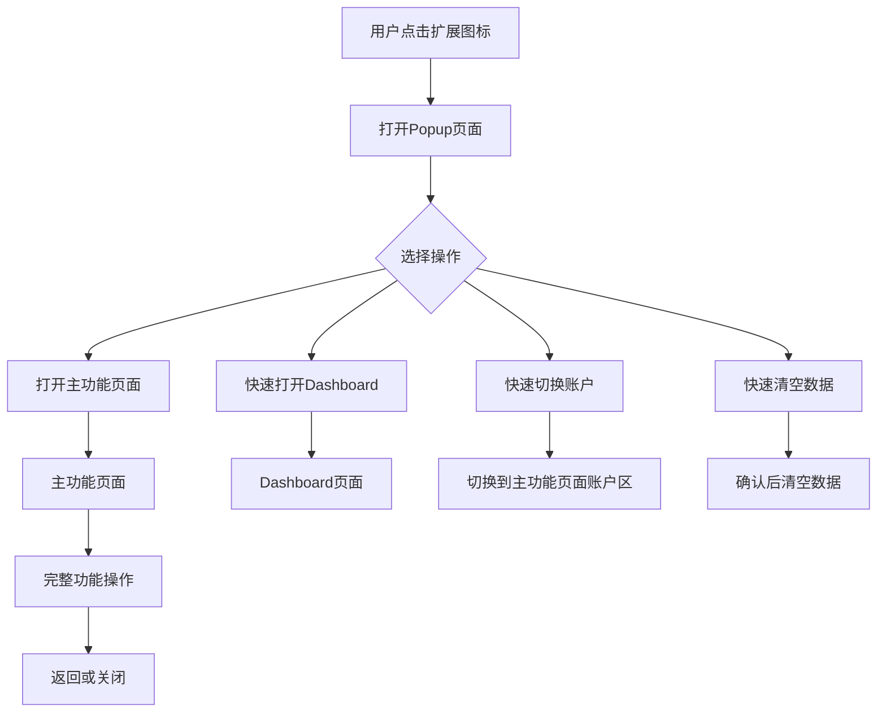

# 🏗️ 架构重构说明 - 功能分离

## 📋 重构概述

将原本集中在popup页面中的所有功能转移到独立的主功能页面中，popup页面改为简洁的入口页面，提供更好的用户体验和代码维护性。

## 🔄 架构变更

### 📁 新文件结构

```
cursor-client2login/
├── popup.html              # 简化的入口页面 (新)
├── popup.js                # 简化的入口脚本 (重构)
├── main.html               # 主功能页面 (新)
├── main.js                 # 主功能脚本 (新)
├── popup_original.html     # 原始popup页面备份
├── popup_original.js       # 原始popup脚本备份
└── test_new_structure.html # 新架构测试页面 (新)
```

### 🎯 页面职责分离

#### 📱 Popup页面 (popup.html/popup.js)
**新职责：** 简洁的入口和快速操作
- **尺寸：** 350x450px (紧凑设计)
- **功能：**
  - 显示当前账户状态
  - 快速打开主功能页面
  - 快速打开Dashboard
  - 快速切换账户
  - 快速清空数据

#### 🖥️ 主功能页面 (main.html/main.js)
**新职责：** 完整的功能操作界面
- **尺寸：** 全屏页面 (最大宽度800px)
- **功能：**
  - 原生主机控制
  - 自动读取Cursor数据
  - 手动输入认证信息
  - 账户列表管理
  - 详细的错误处理和调试

## ✨ 主要改进

### 🎨 用户体验提升
1. **简洁的入口** - Popup页面不再拥挤，快速访问常用功能
2. **专业的功能页** - 主功能页面有更多空间展示详细信息
3. **流畅的导航** - 一键在入口页面和功能页面间切换
4. **响应式设计** - 主功能页面适配不同屏幕尺寸

### 🔧 开发体验提升
1. **代码分离** - 功能模块清晰分离，便于维护
2. **独立测试** - 可以独立测试不同页面的功能
3. **渐进加载** - 按需加载功能模块，提升性能
4. **调试友好** - 每个页面都有独立的调试接口

### 🏗️ 架构优势
1. **模块化设计** - 12个功能模块完整保留
2. **职责单一** - 每个页面职责明确
3. **扩展性强** - 便于添加新功能
4. **向后兼容** - 保留原始文件作为备份

## 🚀 功能迁移详情

### 📦 迁移到主功能页面的模块
- ✅ **ErrorHandler** - 统一错误处理
- ✅ **LoadingManager** - 加载状态管理  
- ✅ **DOMManager** - DOM元素管理
- ✅ **AppState** - 应用状态管理
- ✅ **UIManager** - 用户界面管理
- ✅ **NativeHostManager** - 原生主机通信
- ✅ **AccountManager** - 账户管理
- ✅ **MessageManager** - 消息通信
- ✅ **DashboardManager** - 仪表板管理
- ✅ **EventManager** - 事件管理
- ✅ **JWTDecoder** - JWT智能解析
- ✅ **DataImportManager** - 数据导入管理

### 🎯 Popup页面保留功能
- ✅ **SimpleToast** - 简化Toast通知
- ✅ **SimpleState** - 基础状态管理
- ✅ **QuickActions** - 快速操作处理

## 🔗 页面交互流程



## 📋 使用指南

### 🎯 对于用户
1. **快速操作** - 点击扩展图标使用Popup页面的快速功能
2. **完整功能** - 点击"打开主功能页面"使用所有功能
3. **账户管理** - 在主功能页面进行详细的账户操作

### 🛠️ 对于开发者
1. **调试Popup** - 右键扩展图标 → 检查弹出内容
2. **调试主功能页** - 在主功能页面按F12打开开发者工具
3. **测试架构** - 访问`test_new_structure.html`进行完整测试

## 🧪 测试验证

### 📋 测试清单
- [ ] Popup页面正常显示和交互
- [ ] 主功能页面所有模块正常工作
- [ ] 页面间跳转流畅
- [ ] 所有原有功能完整保留
- [ ] 错误处理机制正常
- [ ] Toast通知系统正常

### 🔧 测试工具
运行测试页面验证新架构：
```bash
# 在Chrome中访问
chrome-extension://[扩展ID]/test_new_structure.html
```

## 📈 性能优化

### ⚡ 加载性能
- **Popup页面** - 轻量级，快速加载
- **主功能页面** - 按需加载，渐进增强
- **代码分离** - 减少不必要的脚本加载

### 💾 内存优化  
- **独立作用域** - 避免全局变量污染
- **事件清理** - 页面卸载时清理事件监听器
- **状态管理** - 精确的状态更新，避免不必要的重渲染

## 🔮 未来扩展

### 🎨 UI增强
- 可考虑添加更多主题选项
- 支持自定义快速操作按钮
- 增加键盘快捷键支持

### 🔧 功能扩展
- 主功能页面可以添加更多高级功能
- 支持多标签页的功能组织
- 增加导入/导出配置功能

### 📱 响应式改进
- 优化移动端显示效果
- 支持不同屏幕分辨率
- 添加无障碍访问支持

---

## ✅ 迁移完成确认

- [x] 创建简化的popup页面
- [x] 创建完整的主功能页面
- [x] 迁移所有功能模块
- [x] 更新manifest.json配置
- [x] 创建测试验证工具
- [x] 备份原始文件
- [x] 编写详细文档

**🎉 架构重构完成！新的分离式架构提供了更好的用户体验和开发体验。**
