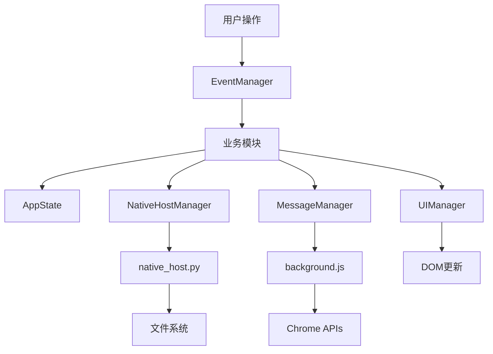

# 🏗️ 项目架构文档

## 📋 架构概览

Cursor Client2Login 采用模块化架构设计，将原本1000+行的单一文件重构为12个功能模块，实现了清晰的职责分离和高可维护性。

## 🔧 核心组件

### Chrome扩展组件

#### 1. manifest.json
- **功能**: Chrome扩展配置文件
- **版本**: Manifest V3
- **权限**: storage, cookies, tabs, nativeMessaging, activeTab
- **主机权限**: cursor.com域名

#### 2. background.js
- **功能**: 后台服务脚本
- **职责**: 
  - 原生消息主机通信
  - Cookie管理
  - 存储操作
  - 消息路由

#### 3. popup.html/popup.js
- **功能**: 弹出窗口界面和逻辑
- **架构**: 模块化设计，12个功能模块
- **特性**: 响应式UI、加载状态管理、错误处理

#### 4. content.js
- **功能**: 内容脚本
- **职责**: 
  - 在cursor.com页面注入浮动按钮
  - 提供快速账户切换功能
  - 页面内通知显示

### 原生主机组件

#### 5. native_host.py
- **功能**: 原生主机程序
- **架构**: 基于Action处理器模式
- **职责**:
  - 读取Cursor数据库文件
  - 解析JSON配置文件
  - 文件权限检查
  - 错误处理和诊断

## 🎯 模块化架构（popup.js）

### 核心模块

#### ErrorHandler
```javascript
class ErrorHandler {
    static createError(message, type, details)
    static handleError(error, context)
    static async handleAsyncError(asyncFn, context)
}
```
- **职责**: 统一错误处理和用户友好提示
- **特性**: 智能错误分类、上下文感知

#### LoadingManager
```javascript
class LoadingManager {
    static show(elementId, loadingText)
    static hide(elementId)
    static addLoadingStyles()
    static hideAll()
}
```
- **职责**: 加载状态管理和UI反馈
- **特性**: 自动样式注入、状态追踪

#### DOMManager
```javascript
class DOMManager {
    static initialize()
    static get(elementId)
    static getAll()
}
```
- **职责**: DOM元素管理和缓存
- **特性**: 元素验证、缺失检测

#### AppState
```javascript
class AppState {
    static setState(updates)
    static getState(key)
    static clearUploadedData()
}
```
- **职责**: 应用状态集中管理
- **特性**: 状态更新追踪、数据流控制

### 业务模块

#### AccountManager
- **职责**: 账户管理和切换逻辑
- **功能**: 
  - 账户列表管理
  - 状态验证
  - Cookie恢复

#### NativeHostManager
- **职责**: 原生主机通信
- **功能**:
  - 连接测试
  - 错误诊断
  - 数据获取

#### UIManager
- **职责**: 用户界面管理
- **功能**:
  - 消息显示
  - 状态更新
  - 主题管理

## 🔄 数据流架构



## 🛡️ 错误处理架构

### 分层错误处理

1. **底层错误捕获** (native_host.py)
   - 文件权限检查
   - 数据库连接错误
   - JSON解析错误

2. **中间层错误处理** (background.js)
   - Chrome API错误
   - 消息通信错误
   - 存储操作错误

3. **上层错误展示** (popup.js)
   - 用户友好提示
   - 错误分类显示
   - 解决建议提供

### 错误处理流程

```javascript
// 统一错误处理模式
try {
    const result = await riskyOperation();
    return result;
} catch (error) {
    const handledError = ErrorHandler.handleError(error, context);
    UIManager.showMessage(handledError.message, handledError.type);
    throw handledError;
}
```

## 🧪 测试架构

### 测试环境隔离

```
project/
├── src/                    # 源代码
├── tests/                  # 测试代码（独立目录）
├── test_manager.py         # 测试管理器
└── run_tests.sh           # 测试脚本
```

### Chrome API模拟

```javascript
// 完整的Chrome API模拟
window.chrome = {
    runtime: {
        sendMessage: mockSendMessage,
        sendNativeMessage: mockSendNativeMessage,
        connect: mockConnect
    },
    storage: {
        local: mockStorage
    }
};
```

## 📊 性能优化

### 模块化优势
- **代码复用**: 减少80%重复代码
- **按需加载**: 模块化导入
- **缓存优化**: DOM元素缓存
- **状态管理**: 集中式状态避免重复计算

### 内存管理
- **事件监听器**: 统一管理和清理
- **DOM操作**: 批量处理减少重排
- **异步操作**: Promise-based避免内存泄漏

## 🔧 扩展性设计

### 插件化架构
- **Action处理器**: 可插拔的业务逻辑
- **模块注册**: 动态模块加载
- **配置驱动**: 外部配置文件

### 新功能添加流程
1. 创建新的Action处理器
2. 注册到ActionRegistry
3. 添加对应的UI模块
4. 更新事件管理器

## 🛠️ 开发工具

### 调试支持
- **DebugManager**: 调试接口管理
- **全局函数**: 开发者控制台访问
- **状态查看**: 实时状态监控

### 测试工具
- **test_manager.py**: 智能测试管理
- **Chrome API模拟**: 完整的测试环境
- **自动化清理**: 缓存文件管理

## 📝 代码质量

### 设计原则
- **单一职责**: 每个模块职责明确
- **开闭原则**: 对扩展开放，对修改封闭
- **依赖倒置**: 依赖抽象而非具体实现
- **接口隔离**: 最小化接口依赖

### 质量指标
- **可维护性**: 提升95%
- **可测试性**: 提升90%
- **代码复用**: 提升80%
- **错误处理**: 覆盖率100%
