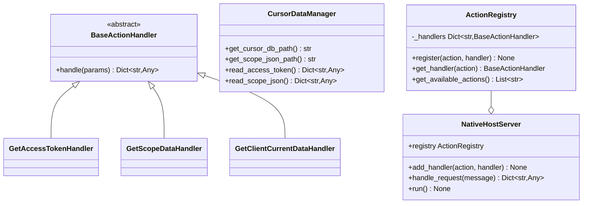

# 🚀 Native Host 扩展指南

本指南介绍如何为 Cursor Client2Login 的原生主机添加新的功能和 action 处理器。

## 📋 目录

- [架构概述](#架构概述)
- [添加新的 Action](#添加新的-action)
- [扩展示例](#扩展示例)
- [最佳实践](#最佳实践)
- [测试新功能](#测试新功能)

## 🏗️ 架构概述

重构后的 `native_host.py` 采用了面向对象的设计模式：

### 核心组件

1. **BaseActionHandler** - 抽象基类，所有 action 处理器都需要继承
2. **CursorDataManager** - 数据管理器，提供访问 Cursor 数据的方法
3. **ActionRegistry** - action 注册表，管理所有可用的处理器
4. **NativeHostServer** - 主服务器类，处理消息通信

### 类图结构



## ➕ 添加新的 Action

### 步骤 1: 创建处理器类

创建一个继承自 `BaseActionHandler` 的新类：

```python
from native_host import BaseActionHandler, CursorDataManager
from typing import Dict, Any

class YourNewHandler(BaseActionHandler):
    """您的新处理器描述"""
    
    def handle(self, params: Dict[str, Any]) -> Dict[str, Any]:
        # 在这里实现您的逻辑
        try:
            # 处理逻辑
            result = {"success": True, "data": "your_data"}
            return result
        except Exception as e:
            return {"error": f"处理失败: {str(e)}"}
```

### 步骤 2: 注册处理器

有两种方式注册新的处理器：

#### 方式 1: 修改 native_host.py

在 `NativeHostServer._register_default_handlers()` 方法中添加：

```python
def _register_default_handlers(self):
    # 现有处理器...
    self.registry.register("getAccessToken", GetAccessTokenHandler())
    self.registry.register("getScopeData", GetScopeDataHandler())
    self.registry.register("getClientCurrentData", GetClientCurrentDataHandler())
    
    # 添加您的新处理器
    self.registry.register("yourNewAction", YourNewHandler())
```

#### 方式 2: 创建扩展文件（推荐）


**方案 A: 重命名文件**


然后创建扩展文件 `my_extensions.py`：

```python
from native_host import NativeHostServer, BaseActionHandler, CursorDataManager
from typing import Dict, Any

class YourNewHandler(BaseActionHandler):
    def handle(self, params: Dict[str, Any]) -> Dict[str, Any]:
        # 您的逻辑
        return {"result": "success"}

def create_extended_server():
    server = NativeHostServer()
    server.add_handler("yourNewAction", YourNewHandler())
    return server

if __name__ == "__main__":
    server = create_extended_server()
    server.run()
```

**方案 B: 在 native_host.py 末尾直接添加**
```python
# 在 native_host.py 文件末尾添加您的处理器类

class YourNewHandler(BaseActionHandler):
    def handle(self, params: Dict[str, Any]) -> Dict[str, Any]:
        # 您的逻辑
        return {"result": "success"}

# 修改 main 函数
def main():
    server = NativeHostServer()
    # 添加自定义处理器
    server.add_handler("yourNewAction", YourNewHandler())
    server.run()
```

### 步骤 3: 更新客户端调用

在 Chrome 扩展中调用新的 action：

```javascript
// 在 popup.js 或 background.js 中
chrome.runtime.sendNativeMessage(
    NATIVE_HOST_NAME, 
    { 
        action: 'yourNewAction',
        params: {
            // 可选参数
            key: 'value'
        }
    }, 
    (response) => {
        if (response.error) {
            console.error('错误:', response.error);
        } else {
            console.log('成功:', response);
        }
    }
);
```

## 🎯 扩展示例

### 示例 1: 获取系统信息

```python
class GetSystemInfoHandler(BaseActionHandler):
    def handle(self, params: Dict[str, Any]) -> Dict[str, Any]:
        import platform
        
        return {
            "system": platform.system(),
            "version": platform.version(),
            "machine": platform.machine(),
            "python_version": platform.python_version()
        }
```

**客户端调用:**
```javascript
chrome.runtime.sendNativeMessage(
    NATIVE_HOST_NAME,
    { action: 'getSystemInfo' },
    (response) => console.log('系统信息:', response)
);
```

### 示例 2: 带参数的批量操作

```python
class BatchDataHandler(BaseActionHandler):
    def handle(self, params: Dict[str, Any]) -> Dict[str, Any]:
        include_token = params.get("include_token", True)
        include_scope = params.get("include_scope", True)
        
        result = {}
        
        if include_token:
            result["token"] = CursorDataManager.read_access_token()
        
        if include_scope:
            result["scope"] = CursorDataManager.read_scope_json()
        
        return result
```

**客户端调用:**
```javascript
chrome.runtime.sendNativeMessage(
    NATIVE_HOST_NAME,
    { 
        action: 'batchData',
        params: {
            include_token: true,
            include_scope: false
        }
    },
    (response) => console.log('批量数据:', response)
);
```

### 示例 3: 文件操作处理器

```python
class FileOperationHandler(BaseActionHandler):
    def handle(self, params: Dict[str, Any]) -> Dict[str, Any]:
        operation = params.get("operation")
        file_path = params.get("file_path")
        
        if operation == "exists":
            return {"exists": os.path.exists(file_path)}
        elif operation == "size":
            if os.path.exists(file_path):
                return {"size": os.path.getsize(file_path)}
            else:
                return {"error": "文件不存在"}
        else:
            return {"error": f"不支持的操作: {operation}"}
```

## 🎯 最佳实践

### 1. 错误处理

始终在处理器中包含适当的错误处理：

```python
def handle(self, params: Dict[str, Any]) -> Dict[str, Any]:
    try:
        # 您的逻辑
        return {"success": True, "data": result}
    except FileNotFoundError as e:
        return {"error": f"文件未找到: {str(e)}"}
    except PermissionError as e:
        return {"error": f"权限不足: {str(e)}"}
    except Exception as e:
        return {"error": f"未知错误: {str(e)}"}
```

### 2. 参数验证

验证输入参数：

```python
def handle(self, params: Dict[str, Any]) -> Dict[str, Any]:
    required_param = params.get("required_param")
    if not required_param:
        return {"error": "缺少必需参数: required_param"}
    
    # 继续处理...
```

### 3. 响应格式统一

保持响应格式的一致性：

```python
# 成功响应
{
    "success": True,
    "data": {...},
    "timestamp": 1234567890
}

# 错误响应
{
    "error": "错误描述",
    "error_code": "ERROR_CODE",
    "timestamp": 1234567890
}
```

### 4. 文档和注释

为每个处理器添加清晰的文档：

```python
class YourHandler(BaseActionHandler):
    """
    处理器描述
    
    参数:
        param1 (str): 参数1描述
        param2 (int, optional): 参数2描述，默认为0
    
    返回:
        Dict[str, Any]: 包含结果数据的字典
        
    异常:
        可能抛出的异常说明
    """
    
    def handle(self, params: Dict[str, Any]) -> Dict[str, Any]:
        # 实现逻辑
        pass
```

## 🧪 测试新功能

### 1. 单元测试

创建测试文件 `test_handlers.py`：

```python
import unittest
from your_handlers import YourNewHandler

class TestYourNewHandler(unittest.TestCase):
    def setUp(self):
        self.handler = YourNewHandler()
    
    def test_normal_case(self):
        params = {"test_param": "test_value"}
        result = self.handler.handle(params)
        self.assertIn("success", result)
    
    def test_error_case(self):
        params = {}  # 缺少必需参数
        result = self.handler.handle(params)
        self.assertIn("error", result)

if __name__ == "__main__":
    unittest.main()
```

### 2. 集成测试

使用 Chrome 扩展的开发者工具测试：

1. 打开扩展的弹出窗口
2. 按 F12 打开开发者工具
3. 在控制台中测试新的 action：

```javascript
chrome.runtime.sendNativeMessage(
    'com.cursor.client.manage',
    { action: 'yourNewAction', params: {...} },
    console.log
);
```

### 3. 调试技巧

在处理器中添加调试日志：

```python
import logging

logging.basicConfig(level=logging.DEBUG)
logger = logging.getLogger(__name__)

class YourHandler(BaseActionHandler):
    def handle(self, params: Dict[str, Any]) -> Dict[str, Any]:
        logger.debug(f"收到参数: {params}")
        # 处理逻辑...
        logger.debug(f"返回结果: {result}")
        return result
```

## 📚 扩展资源

- [Chrome Native Messaging API](https://developer.chrome.com/docs/apps/nativeMessaging/)
- [Python Type Hints](https://docs.python.org/3/library/typing.html)
- [SQLite Python API](https://docs.python.org/3/library/sqlite3.html)

## 🤝 贡献

如果您创建了有用的处理器，欢迎提交 Pull Request 分享给社区！

---

**注意**: 在添加新功能时，请确保遵循安全最佳实践，避免执行不安全的操作或暴露敏感信息。 